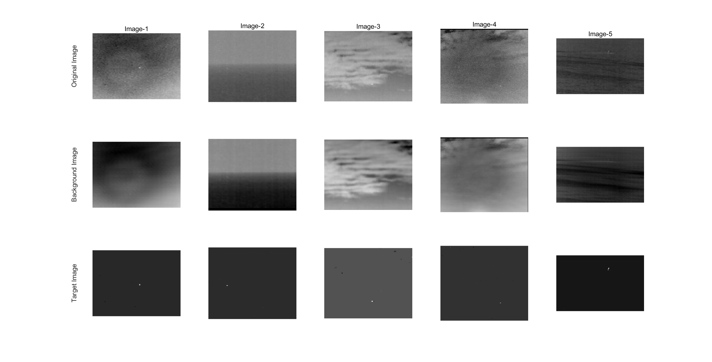

# IPI-for-small-target-detection

## Introduction
This source code  is for small target detection based on Infrared patch-image model in a single image.
If you use this code in your publications, please cite:  
@article{Gao2013IPI,  
   author = {Gao, Chenqiang and Meng, Deyu and Yang, Yi and Wang, Yongtao and Zhou, Xiaofang and Hauptmann, Alex},  
   title = {Infrared Patch-Image Model for Small Target Detection in a Single Image},  
   journal = {Image Processing, IEEE Transactions on},  
   volume = {22},  
   number = {12},  
   pages = {4996-5009},  
   year = {2013}  
}

If you use the test images in your publications, in additoin to above reference, please cite the following reference, too:

@article{Gao2012,  
 author = {Chenqiang, Gao and Tianqi, Zhang and Qiang, Li},  
 title = {Small infrared target detection using sparse ring representation},  
  journal = {IEEE Aerospace and Electronic Systems Magazine},  
   volume = {27},  
   number = {3},  
   pages = {21-30},  
   year = {2012}  
}  

This code is just the core implementation. For real applicaton, we highly suggest to contain effective preprocessing and postprocessing steps for better performance.
Additionally, a good parameter setting for the code discussed in our paper is also suggested to be carefully considered.

Please note that this code does not contain the segmentation step. If you want to get the locations of small targets, you need to further use some segmentation algorithm.

## How to use this code?
You just run the file of *main.m* in matlab. Our matlab version for development is Matlab2013a. 

## Contact
If you have any questions, please contact:  
Author: Chenqiang Gao  
Email: gaochenqiang@gmail.com *or* gaocq@cqupt.edu.cn  
Copyright: Chongqing University of Posts and Telecommunications  
## License
This code is only freely available for non-commercial research use.

If you find some help for you, star is a good reward ^_^. 
